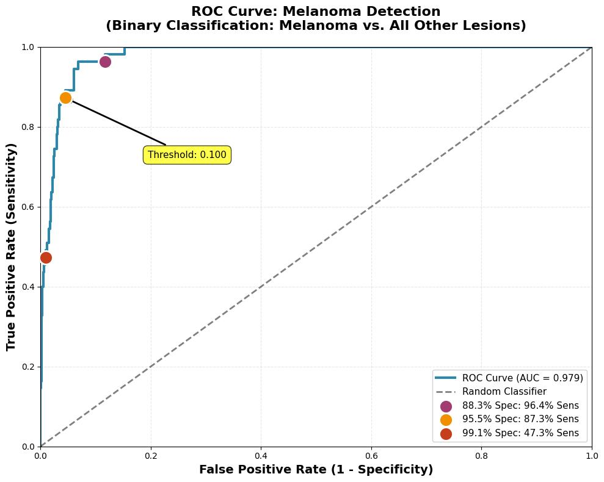

# Derma Diagnostics: Privacy-Preserving Skin Lesion Triage

[](https://opensource.org/licenses/MIT)
[](https://www.python.org/downloads/)
[](https://www.tensorflow.org/js)

A lightweight, browser-based skin lesion classifier designed for rural clinics. This project implements a MobileNetV1 CNN fine-tuned on the HAM10000 dataset to classify 7 types of skin lesions directly on client devices, ensuring patient privacy and enabling offline usage.

## 📄 Abstract

Early melanoma detection saves lives, yet rural clinics often lack dermatologists and reliable connectivity. We present a privacy-preserving, browser-based skin-lesion classifier that returns top-three diagnostic predictions in under 2 seconds on standard smartphones. Using the HAM10000 dataset with leakage-safe lesion-level splitting, we fine-tuned MobileNet with the final 30 layers trainable. The model achieves **ROC-AUC 0.979** for melanoma detection and **96% top-3 accuracy** across 7 lesion types. The TensorFlow.js model runs entirely client-side, safeguarding patient privacy while enabling rapid, accurate triage in resource-limited settings.

## 🚀 Key Features

*   **Privacy-Preserving**: All inference happens locally in the browser using TensorFlow.js. No patient images are uploaded to a server.
*   **Offline Capable**: Once loaded, the application works without an internet connection, suitable for remote areas.
*   **High Performance**: ROC-AUC 0.979 for melanoma detection with <2s inference time on mobile devices.
*   **Leakage-Safe Training**: Implements lesion-level stratified splitting to prevent data leakage (different images of the same lesion never appear in both train and validation sets).

## 📊 Results

The model was evaluated on a held-out validation set of 159 unique lesions (1,039 images) with strict lesion-level splitting.

### Binary Melanoma Detection (ROC Analysis)



| Metric | Value |
|:--- |:--- |
| **ROC-AUC** | **0.979** |
| **Sensitivity at 95% Specificity** | **87.3%** |
| Sensitivity at 90% Specificity | 96.4% |
| Best F1-Score | 0.691 |

### Multi-Class Classification (7 Classes)

| Metric | Value |
|:--- |:--- |
| Top-1 Accuracy | 73.3% |
| Top-2 Accuracy | 89.0% |
| **Top-3 Accuracy** | **95.8%** |
| Macro F1-Score | 0.641 |

### Performance by Class

| Class | Precision | Recall | F1-Score | Support |
|:------|:---------:|:------:|:--------:|:-------:|
| Melanocytic nevi | 0.571 | 0.375 | 0.453 | 32 |
| Melanoma | 0.621 | 0.655 | 0.637 | 55 |
| Benign keratosis | 0.568 | 0.735 | 0.641 | 113 |
| Basal cell carcinoma | 0.667 | 0.556 | 0.606 | 18 |
| Actinic keratoses | 0.964 | 0.743 | 0.839 | 676 |
| Vascular lesions | 0.397 | 0.836 | 0.538 | 122 |
| Dermatofibroma | 0.810 | 0.739 | 0.773 | 23 |

### Inference Performance

| Platform | Inference Time |
|:---------|:--------------:|
| Desktop (Chrome) | ~450ms |
| Mobile (Android) | ~1.2s |
| Mobile (iOS Safari) | ~1.5s |

## 📂 Repository Structure

```
├── data/                   # Dataset storage (excluded from git)
│   ├── processed_grouped/  # Organized train/val folders after lesion-level split
│   └── splits/             # Split metadata (CSVs)
├── src/
│   ├── grouped_split.py    # Script for leakage-safe data preparation
│   └── prepare_data.py     # Basic data preparation script
├── notebooks/
│   └── ML4H_Training_Notebook.ipynb # Main training and evaluation notebook
├── models/                 # Saved model checkpoints
├── figures/                # ROC curves, confusion matrices, training plots
└── README.md
```

## 🛠️ Getting Started

### Prerequisites

*   Python 3.8+
*   TensorFlow 2.x
*   Node.js (for local serving if needed)

### Installation

1.  Clone the repository:
    ```bash
    git clone https://github.com/yourusername/derma-diagnostics.git
    cd derma-diagnostics
    ```

2.  Install Python dependencies:
    ```bash
    pip install -r requirements.txt
    ```

### Data Preparation

1.  Download the **HAM10000** dataset from the [Harvard Dataverse](https://dataverse.harvard.edu/dataset.xhtml?persistentId=doi:10.7910/DVN/DBW86T) or Kaggle.
2.  Place the unzipped files (`HAM10000_images_part_1`, `HAM10000_images_part_2`, and `HAM10000_metadata.tab`) into the `data/` directory.
3.  Run the grouped split script to prepare the data with leakage prevention:
    ```bash
    python src/grouped_split.py
    ```
    This will create `data/processed_grouped/` with `train` and `val` subdirectories.

### Training

Open `notebooks/ML4H_Training_Notebook.ipynb` in Jupyter Notebook or Google Colab to reproduce the training process. The notebook covers:
*   Data loading with augmentation
*   MobileNetV1 transfer learning (last 30 layers trainable)
*   Class weighting with melanoma importance boost
*   Evaluation metrics (Sensitivity, Specificity, ROC-AUC)
*   Calibration (Temperature Scaling)
*   Conversion to TensorFlow.js format

## 🔬 Methodology

### Data Split Strategy
- **Lesion-level splitting**: Ensures no lesion appears in both train and validation sets
- **Train/Val ratio**: 90% / 10% by unique lesions
- **Prevents data leakage**: Different images of the same lesion are grouped together

### Model Architecture
- **Base Model**: MobileNetV1 (ImageNet pretrained)
- **Fine-tuning**: Last 30 layers trainable
- **Head**: GlobalAveragePooling2D → Dropout(0.25) → Dense(7, softmax)
- **Optimization**: Adam (lr=1e-4), ReduceLROnPlateau, EarlyStopping

### Training Configuration
- **Augmentation**: Rotation (180°), width/height shift (10%), zoom (10%), flips
- **Class Weighting**: Balanced weights with 2x boost for melanoma (clinical importance)
- **Batch Size**: 32
- **Epochs**: Up to 50 with early stopping (patience=5)

### Evaluation
- **Multi-class**: Top-1, Top-2, Top-3 accuracy
- **Binary melanoma**: ROC curve analysis with sensitivity at multiple specificity thresholds
- **Calibration**: Temperature scaling applied to improve probability estimates

## ⚠️ Limitations & Future Work

- **Validation distribution**: Lesion-level splitting resulted in non-representative class distribution. External validation on balanced datasets recommended for clinical deployment.
- **Sample size**: Validation set contains 55 melanoma samples. Larger validation cohorts would reduce statistical uncertainty.
- **Dermoscopic images only**: Model trained on dermoscopic images; performance on clinical photos may vary.
- **Population bias**: HAM10000 has known demographic biases. Testing on diverse populations required.

### Next Steps
- External validation on independent datasets
- Prospective clinical study with larger cohort
- Model interpretation using Grad-CAM for explainability
- Multi-center validation to assess generalization

## 🤝 Contributing

Contributions are welcome! Please verify that any data processing changes respect the lesion-level splitting to ensure rigorous evaluation.

## 📜 License

This project is licensed under the MIT License - see the LICENSE file for details.

## 📚 Citation

If you use this code or methodology, please cite:

> Taizhanov, Nurbek. "Derma Diagnostics: Privacy-Preserving Skin Lesion Classification with Edge Inference." (2025, in preparation).

## 🙏 Acknowledgments

- HAM10000 dataset: Tschandl, P., Rosendahl, C., & Kittler, H. (2018)
- MobileNet architecture: Howard, A. G., et al. (2017)
- Clinical validation support: Mediker Hospital, Shymkent, Kazakhstan

---

**Disclaimer**: This is a research project. Not intended for clinical diagnosis without expert supervision.